# Overthewire - writeups CTF

- **Challenge:** Bandit Level 0 -> 33
- **Category:** Linux
- **Difficulty:** Easy
- **Source**: [Overthewire](https://overthewire.org/wargames/bandit/)

**📝Note:** Xin chào các bạn, đây là ```writeup``` đầu tiên mình viết khi mình bắt đầu với ```CTF``` và đặc biệt là ```Pwnable```. Trong bài viết này, mình xin chia sẻ với mọi người về hướng tiếp cận và cách giải của mình về 34 level ```bandit``` ở trên OverTheWire. Các thử thách của bandit chủ yếu xoay quanh các lệnh linux cơ bản, thường hay sử dụng và quan trọng là nó sẽ giúp chúng ta thực hành các vấn đề liên quan về CTF. Vì là bài writeup đầu tiên mình viết nên mong mọi người góp ý.

### Level 0
Level này yêu cầu mình sử dụng ```ssh``` để kết nối vào server ```bandit.labs.overthewire.org``` với port ```2220```, username và password là ```bandit0```.
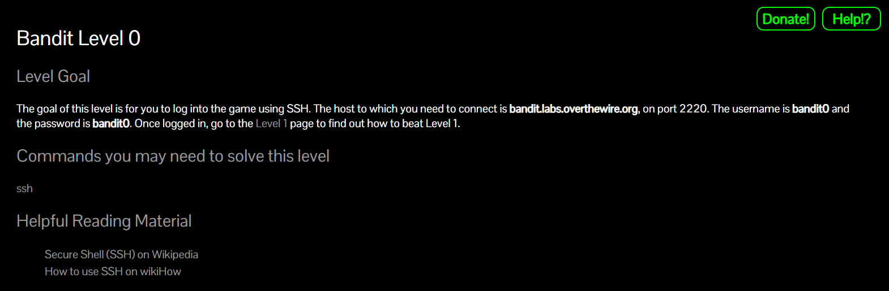

#### Solution
Để kết nối vào server với cổng port 2220 ta sẽ sử dụng thêm option ```-p 2220``` (-p tức là port).

```ssh bandit0@bandit.labs.overthewire.org -p 2220```

Sau đó màn hình sẽ hiện ra yêu cầu nhập pass và khi đó ta chỉ cần nhập pass ```bandit0``` là được.

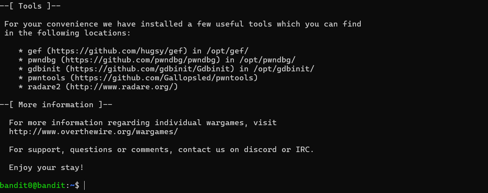

####  References
- [Secure Shell (SSH) on Wikipedia](https://en.wikipedia.org/wiki/Secure_Shell) <br>
- [How to use SSH on wikiHow](https://www.wikihow.com/Use-SSH)

### Level 0 -> level 1
Yeh, sau khi kết nối được vào server thì nó bảo có 1 file có tên là ```readme``` ngay tại thư mục ```home``` chứa password cho level tiếp theo. Và tương tự như vậy, dù ở bất cứ level nào, bạn cần tìm password được giấu ở đâu đó, sau đó ```ssh``` để kết nối tới level tiếp theo.
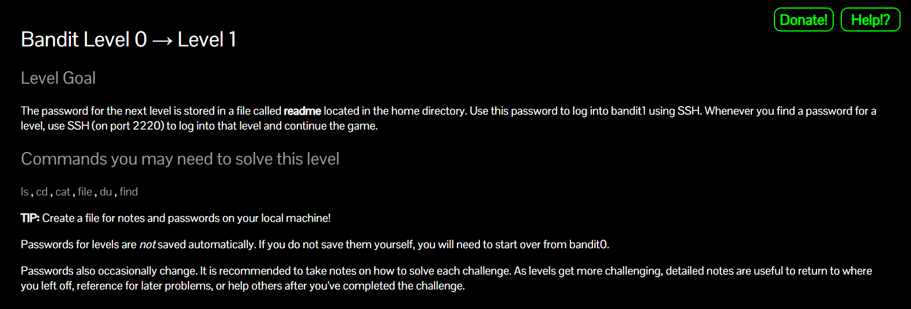

#### Solution
Trước khi giải quyết level này ta cần tìm hiểu về 1 số lệnh sau:
- ```ls```: dùng để xem các file hiện có trong folder
- ```cd```: dùng để di chuyển tới các folder cụ thể
- ```cat```: dùng để xem nội dung của file
- ```file```: dùng để xem kiểu file
- ```du```: dùng để xem dung lượng file và folder
- ```find```: dùng để tìm kiếm file và folder

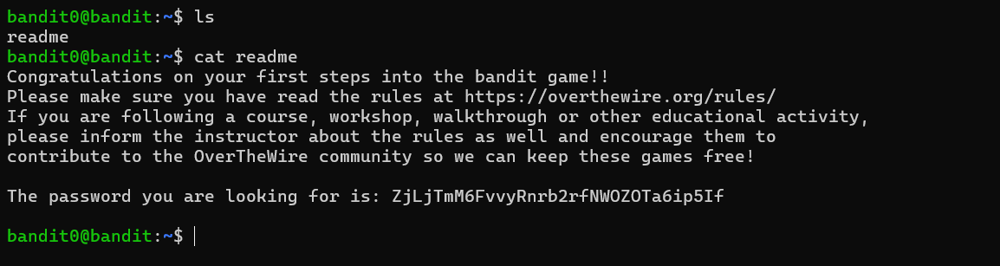
Với 1 số lệnh trên, đầu tiên mình đã thử dùng ```ls``` để xem ở trong folder hiện tại có những file gì thì bất giờ file ```readme``` có ngay ở đây, và sau đó mình dùng ```cat``` để in ra nội dung của file ```readme``` đó. 

Password cho level tiếp theo được hiện ra. (```ZjLjTmM6FvvyRnrb2rfNWOZOTa6ip5If```)

### Level 1 -> level 2
Level này yêu cầu ta mở file có tên là '```-```' được lưu trong folder ```home```.
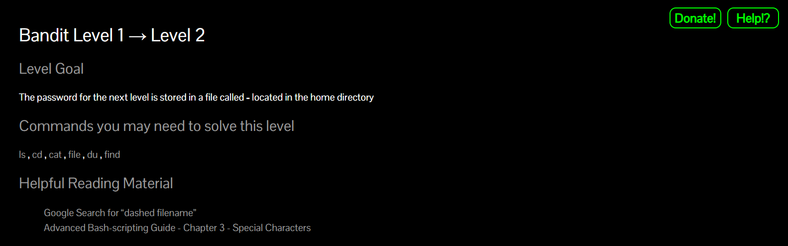
#### Solution
Đối với level này mình sẽ sử dụng lệnh ```cat``` để in password được lưu trong file '```-```' (dashed filename). Tuy nhiên, nếu mình sử dụng ```cat -``` như thông thường, thì nó sẽ không in ra gì cả vì nó sẽ hiểu một cách đặc biệt là lệnh đọc dữ liệu từ bàn phím (stdin) . Vậy nên nếu muốn in ra nội dung của file '```-```' ta cần chỉ rõ đường dẫn của file '```-```'. <br><br>
Cụ thể: ```cat ./-```

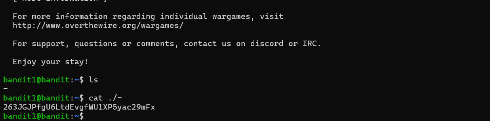
Password cho level tiếp theo được hiện ra. (```263JGJPfgU6LtdEvgfWU1XP5yac29mFx```)

####  References
- [Google Search for "dashed filename"](https://www.google.com/search?q=dashed+filename)
- [Advanced Bash-scripting Guide - Chapter 3 - Special Characters](https://linux.die.net/abs-guide/special-chars.html)

### Level 2 -> level 3
Level này yêu cầu ta mở file có tên là ```--spaces in this filename--``` được lưu trong folder ```home```.
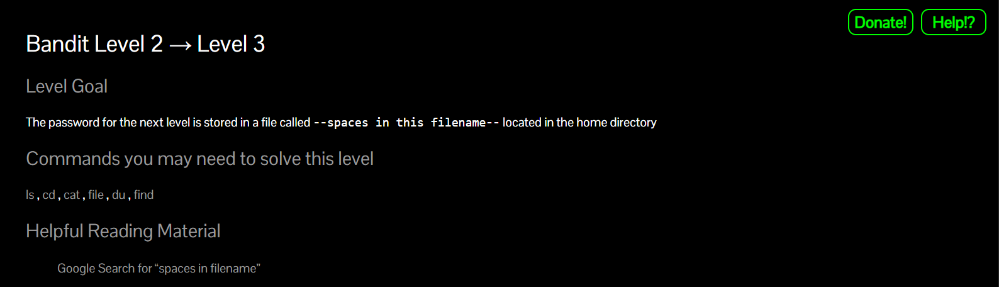
#### Solution
Đối với level này mình sẽ sử dụng ```cat``` để in password được lưu trong file ```--spaces in this filename--``` nhưng ta không thể truy cập folder hoặc file có khoảng cách 1 cách bình thường như vậy mà phải chỉ rõ đường dẫn file và thêm ký tự '```\```' vào trước mỗi khoảng cách.<br>
Cụ thể: ```cat ./--spaces\ in\ this\ filename--```

Ngoài ra, có 1 cách khác là mình có thể thêm 2 dấu nháy đơn(hoặc kép) vào 2 đầu của đường dẫn file đó.<br>
Cụ thể: ```cat './--spaces in this filename--```

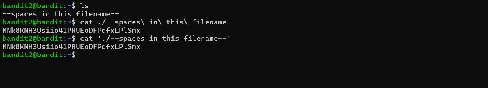

Password cho level tiếp theo được hiện ra. (```MNk8KNH3Usiio41PRUEoDFPqfxLPlSmx```)

####  References
- [Google Search for “spaces in filename”](https://www.google.com/search?q=spaces+in+filename)
- [Dealing With Spaces in Filenames in Linux
](https://linuxhandbook.com/filename-spaces-linux/)

### Level 3 -> level 4

Level này yêu cầu ta mở hidden file được giấu trong folder ```inhere``` để lấy được password cho level tiếp theo.
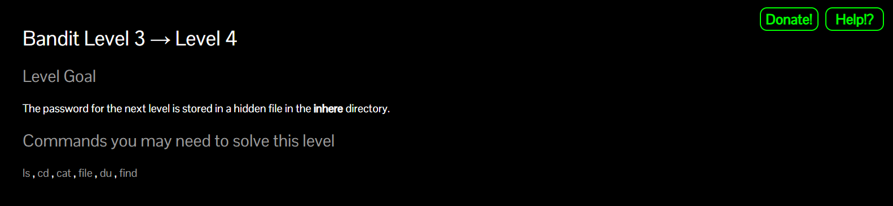

#### Solution
Đối với level này mình sẽ sử dụng ```ls``` để xem các file có trong folder ```inhere``` tuy nhiên, nếu chỉ sử dụng ```ls``` bình thường mà không truyền vào options nào thì nó sẽ không hiện đầy đủ các file (không hiện hidden file). Vì vậy, sau khi tìm hiểu thì mình thấy để hiện đầy đủ các file có trong 1 folder thì ta phải thêm option ```-a``` (all) vào.<br>
Cụ thể: ```ls -a inhere```

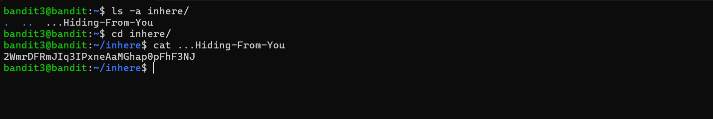 <br>

Password cho level tiếp theo được hiện ra. (```2WmrDFRmJIq3IPxneAaMGhap0pFhF3NJ```)

### Level 4 -> level 5
Level này yêu cầu ta mở file duy nhất có thể đọc trong số các file ở trong folder ```inhere``` để có thể lấy được password cho level tiếp.

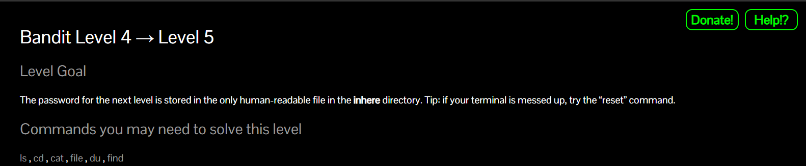

#### Solution
Như theo mô tả đề bài ta có thể thấy, chỉ có duy nhất 1 file có thể đọc. Vì vậy, ta sử dụng lệnh ```file``` để có thể in ra thông tin về file đó. Và đặc biệt hơn, trong bài này có tận 10 file khác nhau nên cách tốt nhất để in ra các thông tin của các file trong cùng 1 lần ta có thể truyền vào đường dẫn như sau.<br>
Cụ thể: ```file ./inhere/*```<br>
```*``` trong trường hợp này có ý nghĩa là nó sẽ bao gồm tất cả các file có ở trong folder ```inhere```.

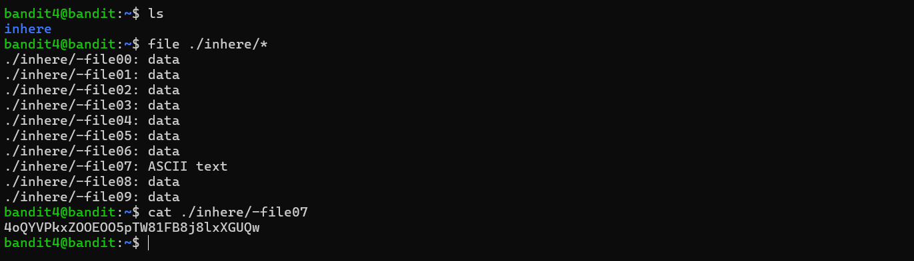

Password cho level tiếp theo được hiện ra. (```4oQYVPkxZOOEOO5pTW81FB8j8lxXGUQw```)

### Level 5 -> level 6

Level này yêu cầu ta cần tìm password được lưu trong 1 file và được lưu dưới 1 folder. Ngoài ra, ta được cung cấp thêm thông tin là file đó có các thông tin về file như:
- human-readable (File đó có thể đọc)
- 1033 bytes in size (File có kích thước 1033byte)
- not executable (File đó không thể thực thi)

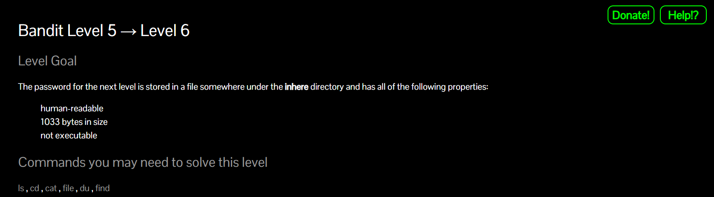

#### Solution
Dựa trên các thông tin mà file đó cung cấp, ta có thể brute-force để tìm file có đầy đủ các thông tin đó=)). Hoặc cách để tìm cách tốt hơn thì ta có thể lọc ra các file có các thông tin đó.

1. ```human-readable```: ta có thể sử dụng lệnh ```file``` in ra thông tin các file sau đó kết hợp sử dụng lệnh ```grep``` để lọc ra các file có dạng dữ liệu là ```ASCII text```.<br> Cụ thể: ```file */* | grep "ASCII text"```
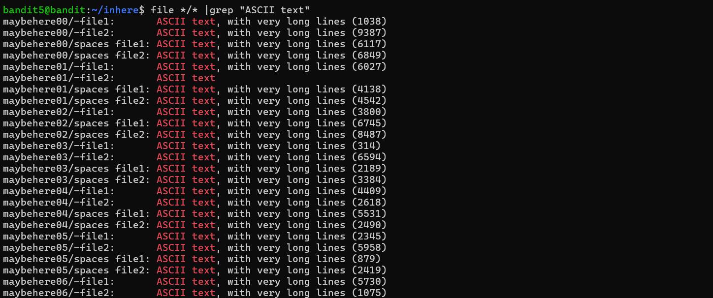
2. ```1033 bytes in size```: ta có thể sử dụng lệnh ```find``` để tìm các file với option ```-size 1033c```. (1033c tức là 1033bytes)<br>
Cụ thể: ```find . -size 1033c```
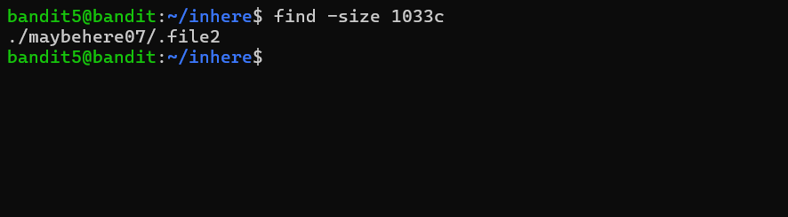
3. ```not executable```: ta có thể sử dụng lệnh ```find``` để tìm các file với option ```-executable```. (File không thể thực thi) <br>
Cụ thể: ```find . -executable```
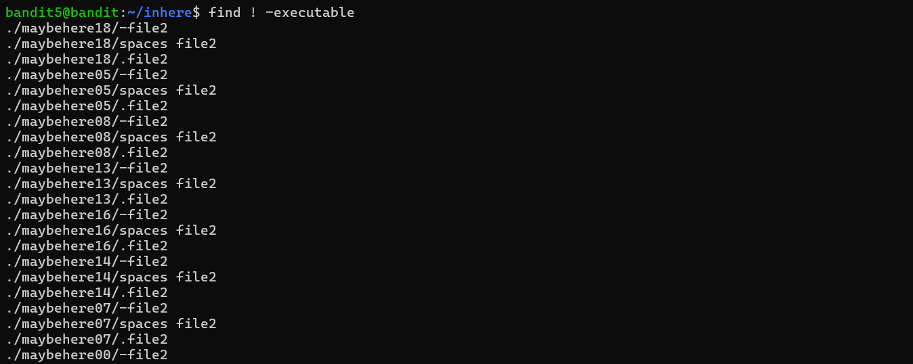

Như vậy, đối với 2 thông tin ```human-readable``` và ```not executable``` thì có rất nhiều file có thông tin đó, tuy nhiên đối với thông tin ```1033 bytes in size``` thì chỉ có duy nhất 1 file là ```./maybehere07/.file2```. Vì vậy ta có thể chọn thông tin này để tìm kiếm file đó là cách tốt nhất.

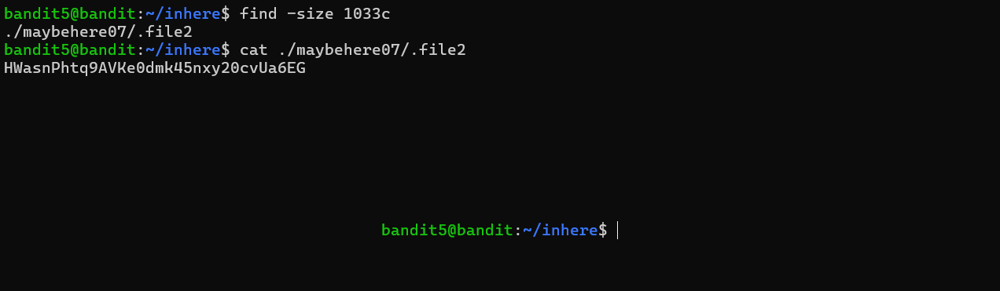

Password cho level tiếp theo được hiện ra. (```HWasnPhtq9AVKe0dmk45nxy20cvUa6EG```)

### Level 6 -> level 7
Level này yêu cầu ta cần tìm password được giấu trong 1 file, và file được lưu ở đâu đó trong server. Và file đó có các thông tin như sau: <br>
- owned by user bandit7 (thuộc sở hữu của người dùng bandit7)
- owned by group bandit6 (thuộc sở hữu của nhóm bandit6)
- 33 bytes in size: file có kích thước là 33 bytes

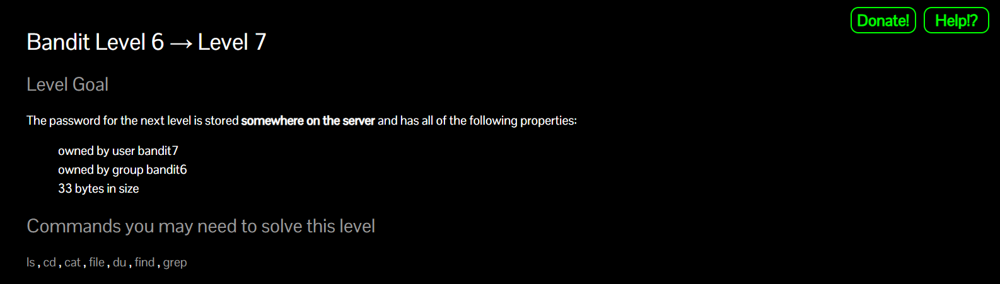

#### Solution
Như ta có thể thấy ở trên ta đã được cung cấp 3 thông tin về user, group và size. Vì thế, mình đã sử dụng lệnh ```find``` để tìm file có đầy đủ các thông tin đó.<br>
Cụ thể: ```find -user bandit7 -group bandit6 -size 33c```
- option -user: tìm theo người dùng sở hữu
- option -group: tìm theo nhóm sở hữu
- option -size: tìm theo kích thước

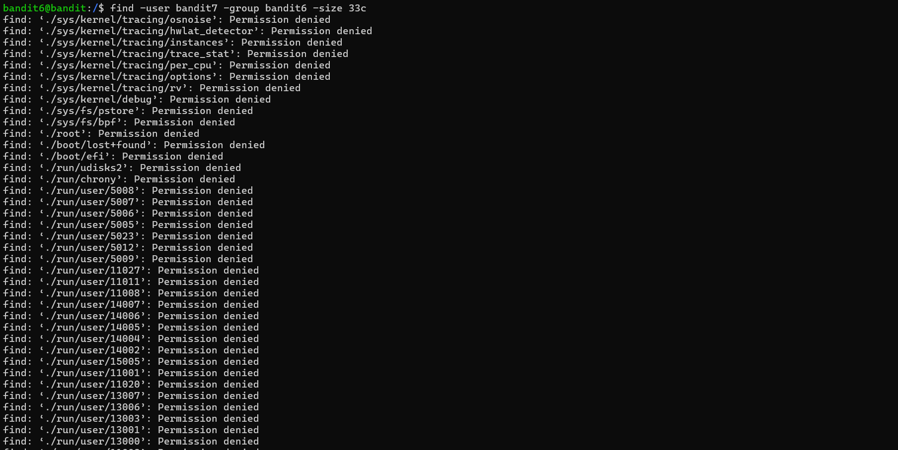
Ta có thể thấy ở trong hình, nó vẫn cho ra rất nhiều file có những thông tin đó. Sau đó, mình đã thử dụng ```grep``` để lọc thử xem thì khi mình thử truyền keyword là ```bandit7``` thì thật may mắn nó cho ra kết quả là 1 file có tên như vậy (```./var/lib/dpkg/info/bandit7.password```). Và mình thử ```cat``` ra xem thì thực sự có password được lưu ở trong đó.

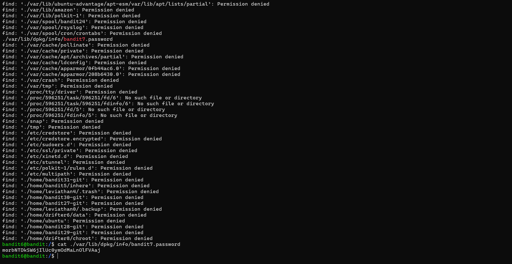

Password cho level tiếp theo được hiện ra. (```morbNTDkSW6jIlUc0ymOdMaLnOlFVAaj```)

### Level 7 -> level 8
Level này yêu cầu ta cần tìm password được giấu trong file ```data.txt```. Và password được lưu bên cạnh từ ```millonth```.


#### Solution
Trước khi giải quyết level này ta cần tìm hiểu về 1 số lệnh sau:
- ```man```: dùng để xem hướng dẫn sử dụng 1 lệnh nào đó.
- ```grep```: dùng để tìm kiếm 1 chuỗi các ký tự trong 1 output hoặc 1 file nào đó.
- ```sort```: dùng để sắp xếp các dòng trong 1 file văn bản hoặc 1 output nào đó.
- ```uniq```: dùng để loại bỏ các dòng trùng lặp trong 1 file văn bản hoặc 1 output nào đó.
- ```strings```: dùng để in ra các chuỗi ký tự có thể in được từ 1 file nhị phân.
- ```base64```: dùng để mã hóa hoặc giải mã dữ liệu theo chuẩn base64.
- ```tr```: dùng để dịch hoặc xóa các ký tự.
- ```tar```: dùng để nén và giải nén các file.
- ```gzip```: dùng để nén và giải nén các file theo định dạng gzip.
- ```bzip2```: dùng để nén và giải nén các file theo định dạng bzip2.
- ```xxd```: dùng để tạo ra 1 bản hex dump hoặc chuyển đổi giữa hex dump và binary.

Đối với level này, đầu tiên mình sẽ sử dụng lệnh ```cat``` để in ra nội dung của file ```data.txt``` sau đó kết hợp sử dụng ```grep``` để tìm từ ```millionth``` vì password nằm ở bên cạnh từ này.<br>
Cụ thể: ```cat data.txt | grep "millionth"```

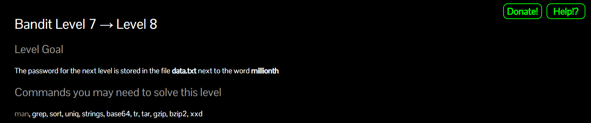

Password cho level tiếp theo được hiện ra. (```dfwvzFQi4mU0wfNbFOe9RoWskMLg7eEc```)

### Level 8 -> level 9 
Level này yêu cầu ta cần tìm password được giấu trong file ```data.txt```. Và password là dòng chỉ xuất hiện 1 lần duy nhất trong file đó.

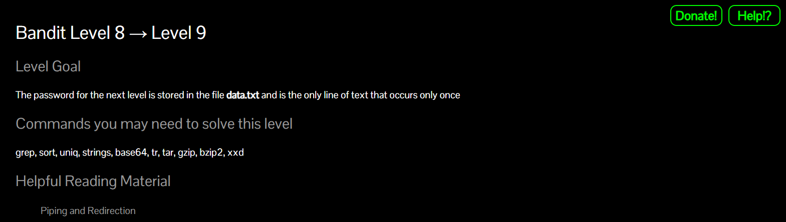

#### Solution
Đối với level này, mình sẽ sử dụng lệnh ```sort``` để sắp xếp các dòng trong file ```data.txt```, sau đó mình sẽ kết hợp sử dụng lệnh ```uniq``` để loại bỏ các dòng trùng lặp, tuy nhiên mình sẽ sử dụng thêm option ```-u``` để nó chỉ giữ lại các dòng duy nhất.

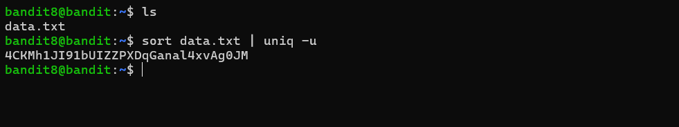

Password cho level tiếp theo được hiện ra. (```4CKMh1JI91bUIZZPXDqGanal4xvAg0JM```)

####  References
- [Piping and Redirection](https://ryanstutorials.net/linuxtutorial/piping.php)

### Level 9 -> level 10
Level này yêu cầu ta cần tìm password được giấu trong file ```data.txt```. Và password là 1 trong các từ có thể đọc được và theo sau 1 vài ký tự ```=``` trong file đó.

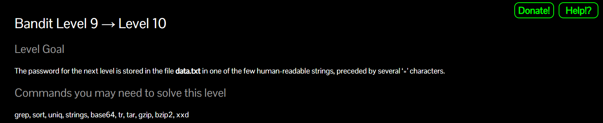

#### Solution
Đối với level này, mình sẽ sử dụng lệnh ```strings``` để in ra các chuỗi ký tự có thể đọc được từ file ```data.txt``` và kết hợp sử dụng lệnh ```grep``` để lọc những dòng có chữa ký tự ```=```.


Password cho level tiếp theo được hiện ra. (```FGUW5ilLVJrxX9kMYMmlN4MgbpfMiqey```)

### Level 10 -> level 11
Level này yêu cầu ta cần tìm password được giấu trong file ```data.txt```. Tuy nhiên, data của file này đã được mã hóa base64.

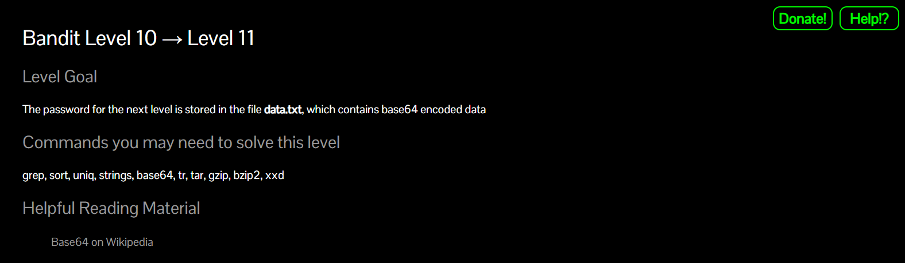

#### Solution
Đối với level này, mình sẽ sử dụng lệnh ```base64``` để giải mã data trong file ```data.txt``` với option ```-d``` (decode).

Cụ thể: ```base -d data.txt```

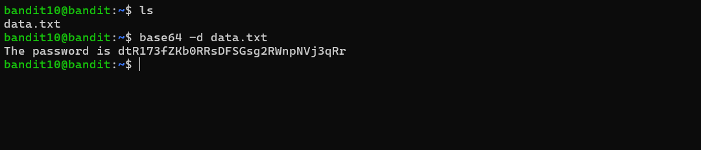

Password cho level tiếp theo được hiện ra. (```dtR173fZKb0RRsDFSGsg2RWnpNVj3qRr```)

####  References
- [Base64 on Wikipedia](https://en.wikipedia.org/wiki/Base64)

### Level 11 -> level 12
Level này yêu cầu ta cần tìm password được giấu trong file ```data.txt```. Tuy nhiên, các kí tự in thường và in hoa của file nãy đã được dịch chuyển 13 vị trí.

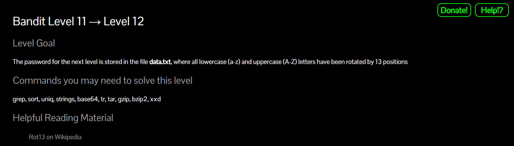

#### Solution
Đối với level này, mình sẽ sử dụng lệnh ```tr``` để dịch chuyển các kí tự in hoa và in thường sang 13 kí tự nữa để quay lại vị trí ban đầu. (Vì có tổng cộng 26 kí tự)

Cụ thể: ```tr 'A-Za-z' 'N-ZA-z < data.txt```

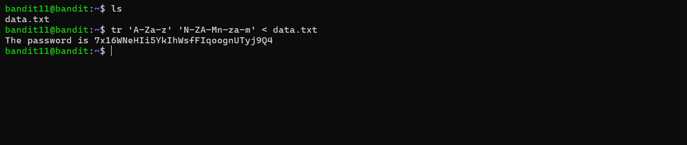

Password cho level tiếp theo được hiện ra. (```7x16WNeHIi5YkIhWsfFIqoognUTyj9Q4```)

### Level 12 -> level 13
Level này yêu cầu ta cần tìm password được giấu trong file ```data.txt```. Tuy nhiên, file này là 1 file hex dump và được nén nhiều lần.

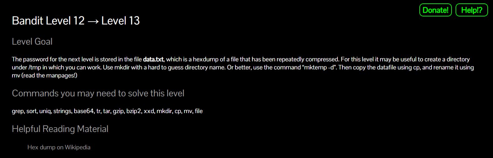

#### Solution
Trước khi giải quyết level này ta cần tìm hiểu về 1 số lệnh sau:
- ```cp```: dùng để copy file hoặc folder
- ```mv```: dùng để di chuyển hoặc đổi tên file hoặc folder
- ```mkdir```: dùng để tạo folder
Đối với level này, mình sẽ sử dụng lệnh ```xxd``` để chuyển đổi file hex dump sang dạng binary với option ```-r``` (reverse). Và sau đó mình sẽ sử dụng lệnh ```file``` để xem thông tin phù hợp về file đó. Sau đó mình sẽ đổi tên file phù hợp và thực hiện giải nén nhiều lần.

Cụ thể: ```xxd -r data.txt data```

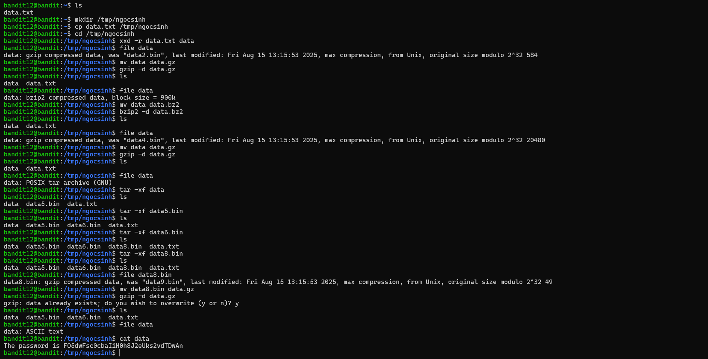

Password cho level tiếp theo được hiện ra. (```FO5dwFsc0cbaIiH0h8J2eUks2vdTDwAn```)

####  References
- [Hex Dump on Wikipedia](https://en.wikipedia.org/wiki/Hex_dump)

### Level 13 -> level 14
Level này chứa password cho level tiếp theo, tuy nhiên password chỉ đọc được bởi user bandit14. Nhưng ta lại được cung cấp 1 private SSH key dùng để kết nối vào level tiếp theo.

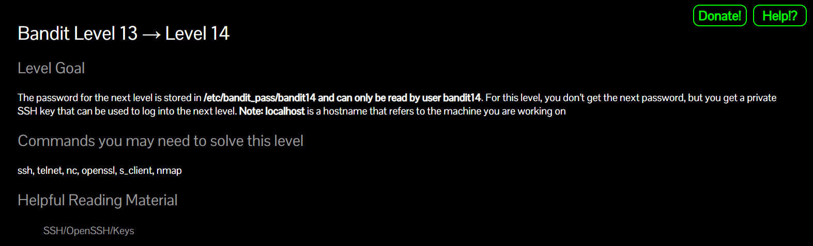

#### Solution
Trước khi giải quyết level này ta cần tìm hiểu về 1 số lệnh sau:
- ```ssh``: dùng để kết nối bảo mật vào server
- ```telnet```: dùng để kết nối không bảo mật vào server
- ```nc```: công cụ gửi/nhận dữ liệu qua TCP/UDP,...
- ```openssl```: dùng để mã hóa, giải mã dữ liệu, tạo và kiểm tra các kết nối SSL/TLS
- ```s_client```: lệnh con của ```openssl``` dùng để kết nối vào server SSL/TLS
- ```nmap```: dùng để scan mạng như tìm host, tìm port, ...

Đối với level này, mình sẽ sử dụng lệnh ```ssh``` để kết nối vào level tiếp theo (level 14), và mình sẽ sử dụng thêm option ```-i``` để truyền vào path của ```sshkey.private```.

Cụ thể: ```ssh bandit14@bandit.labs.overthewire.org -p 2220 -i sshkey.private```

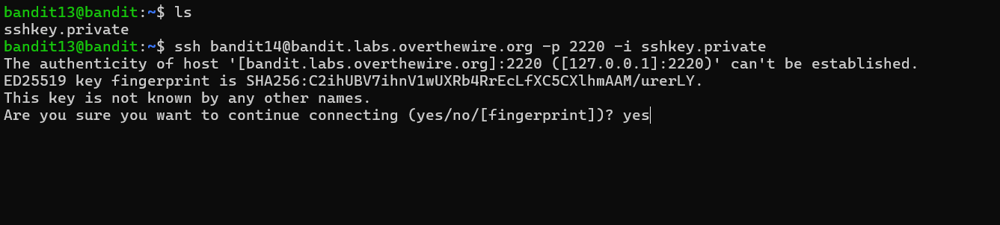

Và thế là mình đã kết nối được tới level tiếp theo.

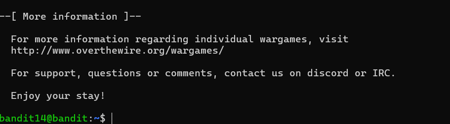